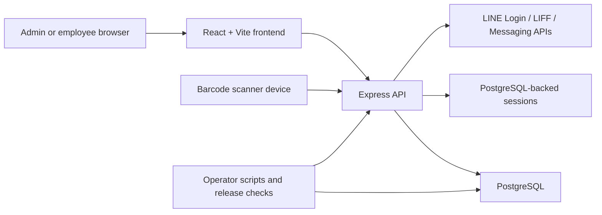

# Public Architecture

This document gives external contributors and operators a fast map of the major runtime pieces in the public repository.

## High-Level Flow

## Runtime Components

### Frontend

- Lives in `client/`
- Provides admin workflows, attendance and salary UI, recycle-bin management, and LIFF-enabled employee flows
- Uses the API as the source of truth for business data and session-aware actions

### API Server

- Lives mainly in `server/`
- Owns auth, session validation, env validation, business rules, and release safety checks
- Exposes admin, employee, attendance, salary, backup, health, and LINE integration routes

### Database

- PostgreSQL is the only supported primary datastore
- Drizzle ORM and checked-in schema files define and evolve the public schema surface
- Sessions and operational records are expected to persist outside the repository workspace

### LINE Integration

- Handles login callback flow, LIFF authentication, account binding, and webhook-related behavior
- Requires operator-managed callback URLs, LIFF endpoint alignment, and channel secrets outside git

### Scanner / Device Flows

- Barcode and kiosk paths rely on device-side scanning plus server-side validation
- Device tokens and endpoint configuration must be managed as deployment secrets

## Release and Operations Boundaries

- CI validates type checks, tests, build integrity, smoke coverage, and release-readiness checks
- Deployment settings such as secrets, callback URLs, branch protection, and canary monitoring live outside the repository
- Public docs intentionally omit internal hostnames, private runbooks, and historical operational handoff material

## Read This Next

- [README.md](../README.md)
- [docs/CONFIGURATION.md](./CONFIGURATION.md)
- [docs/DEPLOYMENT_GUIDE.md](./DEPLOYMENT_GUIDE.md)
- [docs/OPERATIONS_RUNBOOK.md](./OPERATIONS_RUNBOOK.md)
- [docs/SUPPORT_POLICY.md](./SUPPORT_POLICY.md)
